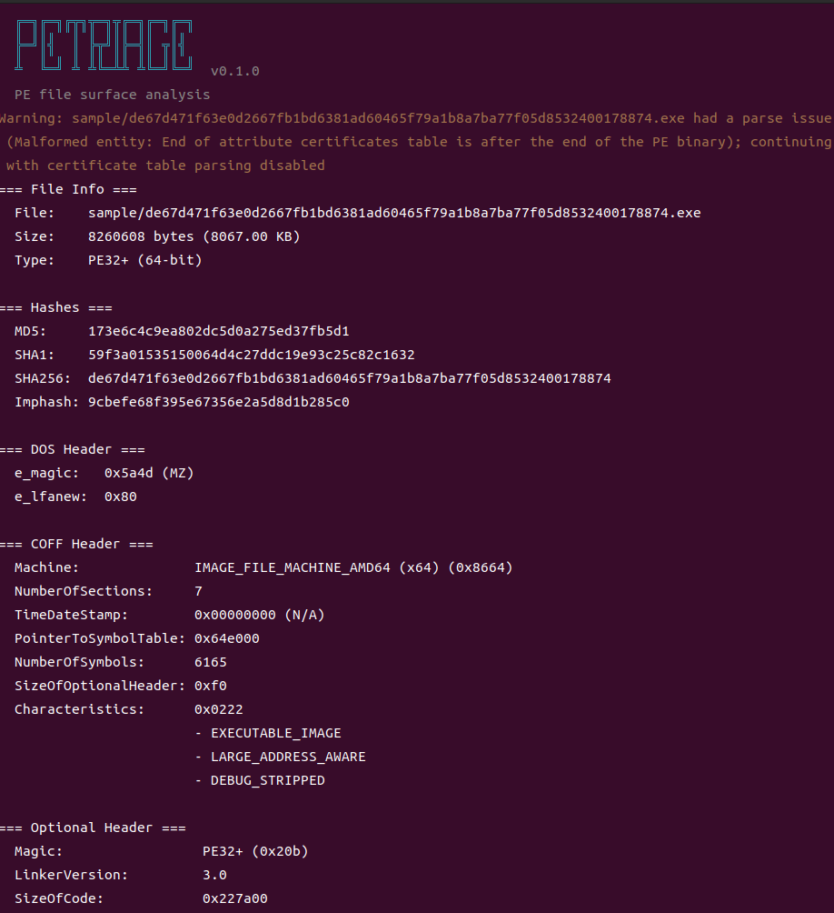
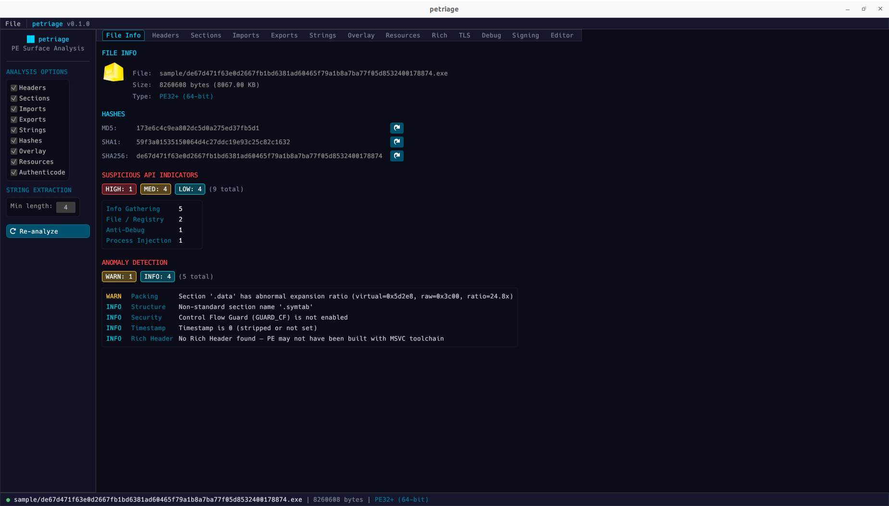
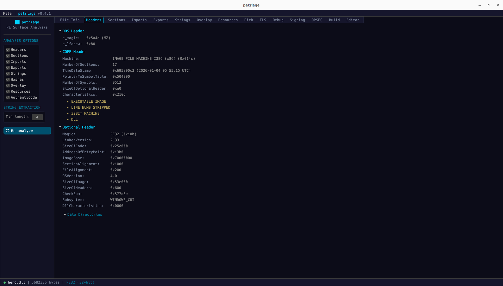
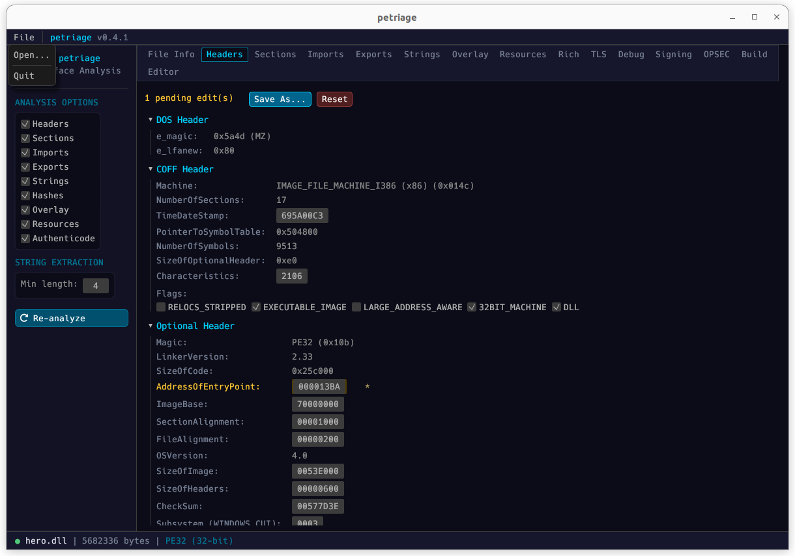

<p align="center">
  
</p>

# PETriage

[](https://blackhat.com/us-26/arsenal/schedule/index.html#petriage-cross-platform-pe-surface-analysis-for-malware-triage-51977)
[](https://crates.io/crates/petriage)
[](https://docs.rs/petriage)
[](https://github.com/uky007/PETriage)
[](https://github.com/uky007/PETriage/tags)

A fast, cross-platform PE (Portable Executable) surface analysis tool for malware triage, written in Rust.
Designed for analysts who need practical PE triage on Linux, macOS, and Windows without relying on a Windows-only workflow.

Formerly `readpe` (renamed to avoid naming collisions with existing tools).

Presented at [Black Hat USA 2026 Arsenal](https://blackhat.com/us-26/arsenal/schedule/index.html#petriage-cross-platform-pe-surface-analysis-for-malware-triage-51977).

## Concept

- **Static-only** -- The PE is never loaded or executed. Safe for malware triage.
- **CLI-first** -- Lightweight default workflow suitable for batch analysis and automation.
- **Composable** -- JSON/NDJSON output for piping to `jq`, SIEMs, and scripting pipelines.
- **Offline** -- No network calls. Suitable for fully air-gapped environments.

## Interfaces

| Interface | Build | Description |
|-----------|-------|-------------|
| **CLI** | `cargo build --release` | Default workflow for PE triage, structured output, anomaly detection, and batch automation. |
| **TUI** | `cargo build --release --features tui` | Interactive hex viewer with PE region navigation. |
| **GUI** | `cargo build --release --features gui` | Tabbed analysis, drag & drop, import/string filters, entropy color-coding, PE header editor, overlay carve/strip. |

## Quick Install

Default CLI build:

```
cargo install petriage
```

For TUI and GUI builds, build from source with feature flags.

Or build from source:

```
git clone https://github.com/uky007/petriage.git
cd petriage
cargo build --release
```

See [docs/installation.md](docs/installation.md) for GUI/TUI build dependencies and cross-compilation.

## Quick Usage

```
petriage <file.exe>              # Surface analysis (all except strings)
petriage <file.exe> -a           # All information including strings
petriage <file.exe> -H           # Headers only
petriage <file.exe> -i           # Imports only
petriage <file.exe> --hashes     # File hashes only
petriage <file.exe> --json       # JSON output
petriage --batch <dir> --ndjson  # Batch-analyze all PEs in a directory
petriage <file.exe> --fail-on warning  # Exit code 3 if anomalies meet the selected threshold
petriage <file.exe> --strip-overlay stripped.exe  # Save PE without overlay
petriage <file.exe> --carve-overlay overlay.bin   # Extract overlay data
```

```
petriage -x <file.exe>           # TUI hex viewer
petriage-gui                     # GUI (file dialog)
petriage-gui <file.exe>          # GUI (open file directly)
```

See [docs/usage.md](docs/usage.md) for full CLI options, `jq` recipes, TUI/GUI details, and example output.

## Key Features

- **25 anomaly rules** -- Packing, code injection, timestamp manipulation, structural anomalies, OPSEC leaks, Rich Header tampering, Export Directory anomalies
- **OPSEC analysis** -- PDB paths, credential patterns, endpoint detection, CI/CD path hints, source path username leaks
- **Build fingerprinting** -- .NET / Go / Rust / MSVC / MinGW detection with packer identification (UPX, Themida, VMProtect, NSIS, etc.)
- **Overlay carve/strip** -- Extract overlay data or save PE without overlay (CLI and GUI)
- **Export Directory analysis** -- DLL name, timestamp, function counts with anomalous timestamp detection
- **Semantic header editing** (GUI) -- Machine/Subsystem dropdowns, human-readable timestamps, DllCharacteristics flag checkboxes
- **Non-standard section highlighting** -- Yellow highlight for unusual section names in CLI and GUI

## Screenshots

### CLI



### GUI



### Headers (Structure View + Editor)



### Header Editor (Inline Editing)



## Exit Codes

| Code | Meaning |
|------|---------|
| 0 | Success |
| 1 | Input error (file not found, read failure, invalid PE) |
| 2 | Output error (file write failure) |
| 3 | Anomaly threshold exceeded (`--fail-on`) |

## Docs

- [Overview & Features](https://github.com/uky007/PETriage/blob/main/docs/description.md)
- [Installation](https://github.com/uky007/PETriage/blob/main/docs/installation.md)
- [Usage & Examples](https://github.com/uky007/PETriage/blob/main/docs/usage.md)
- [Survey of Existing Tools](https://github.com/uky007/PETriage/blob/main/docs/survey.md)
- [Future Work](https://github.com/uky007/PETriage/blob/main/docs/future_work.md)

## License

MIT OR Apache-2.0
