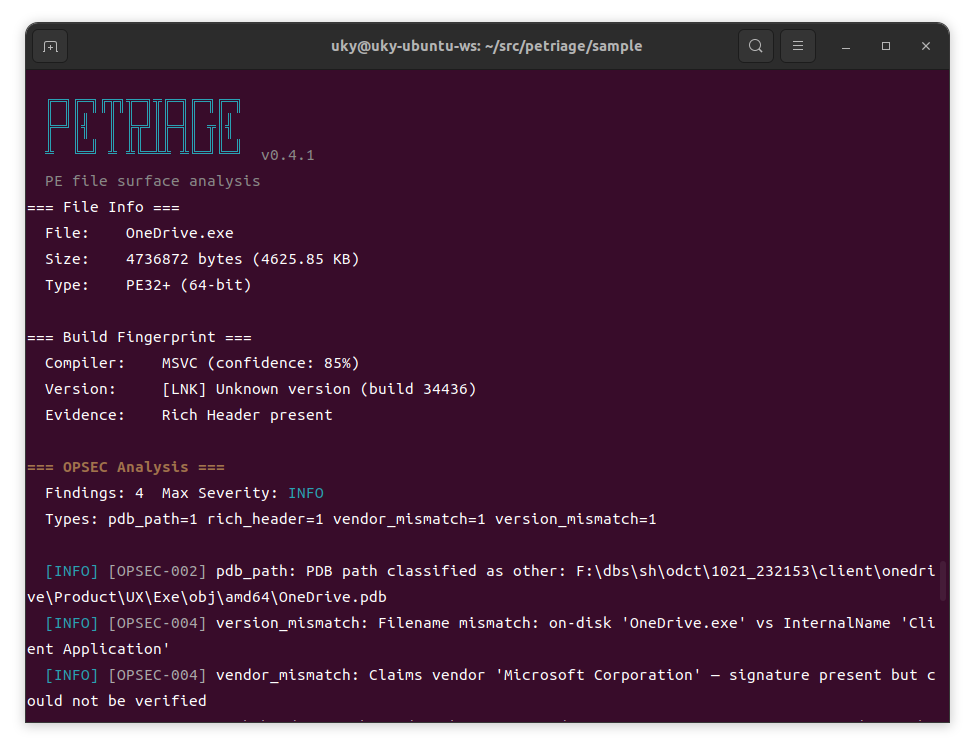
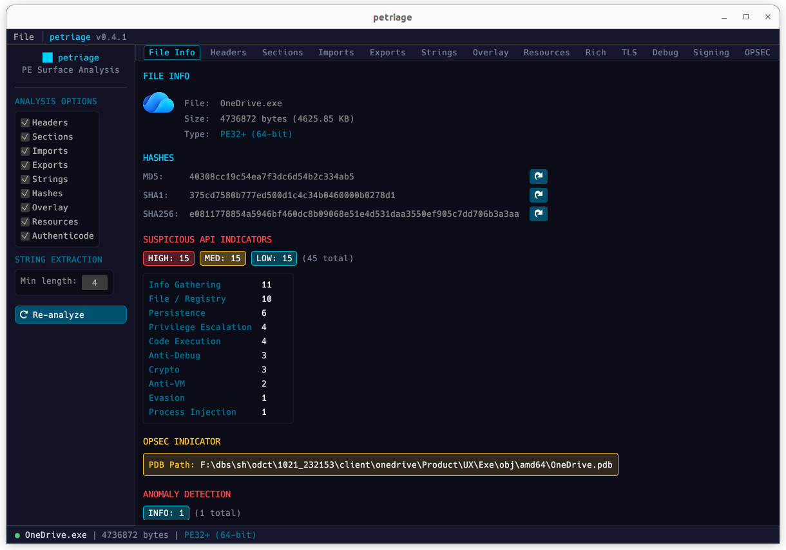
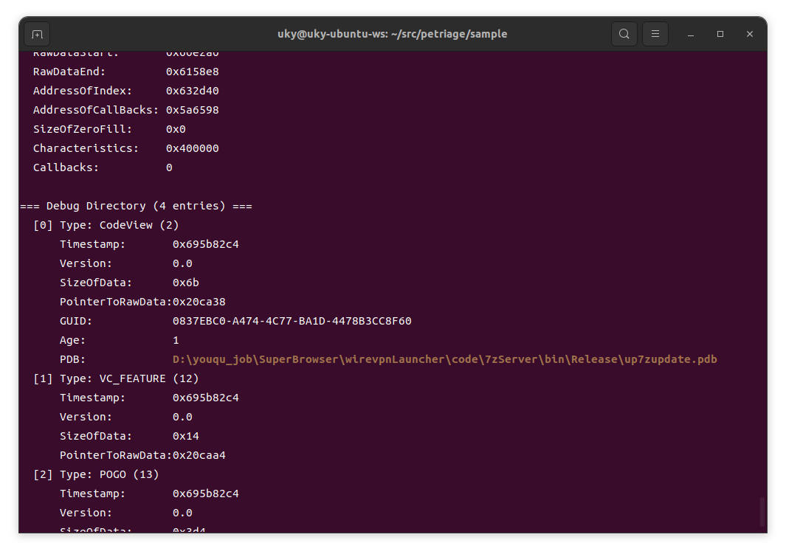
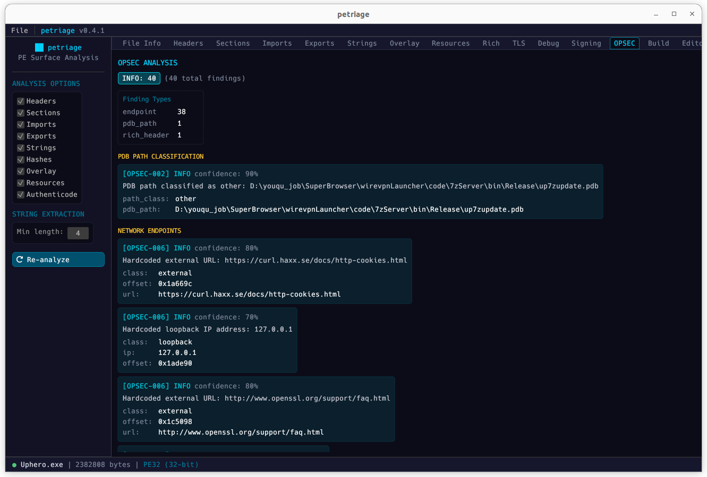
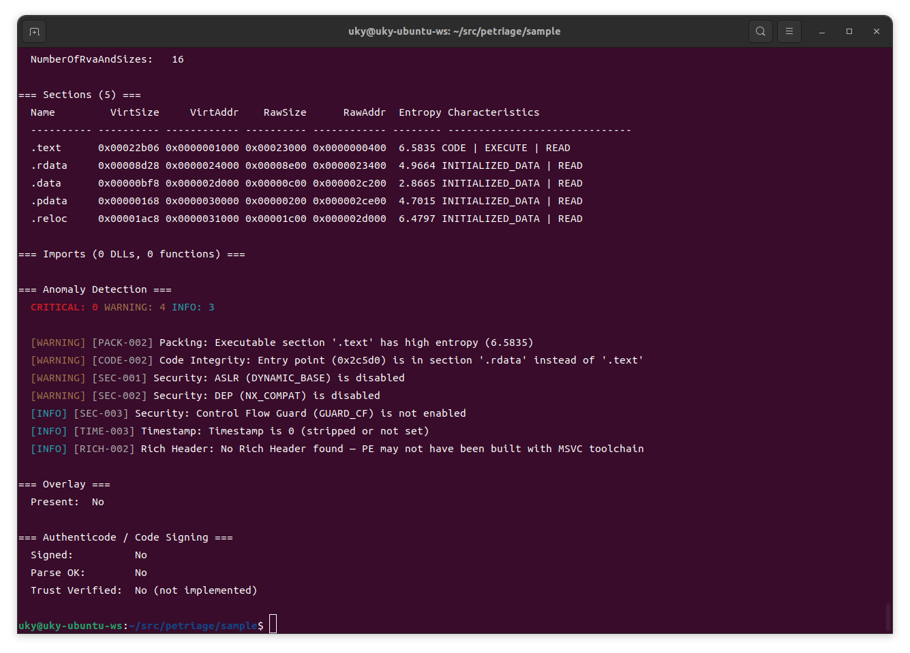
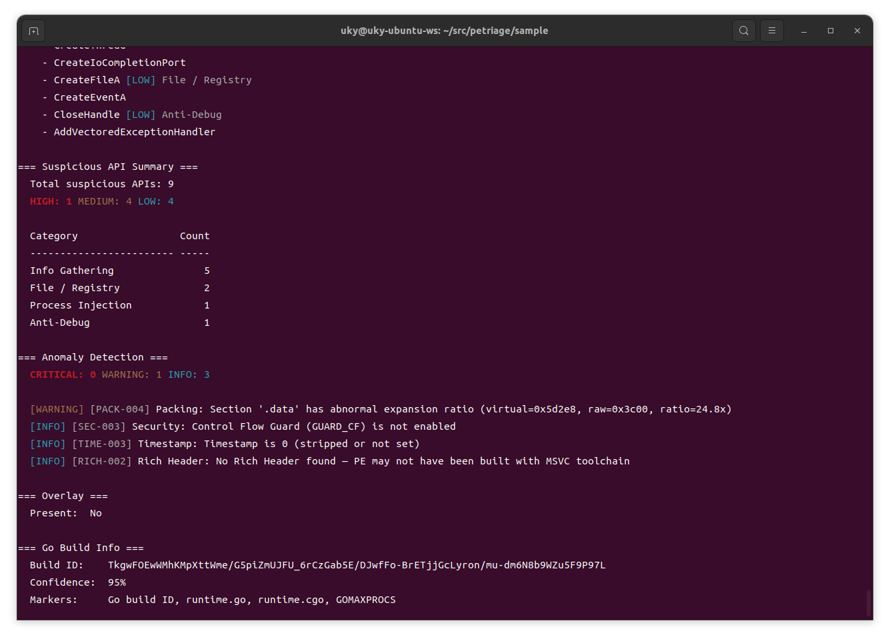
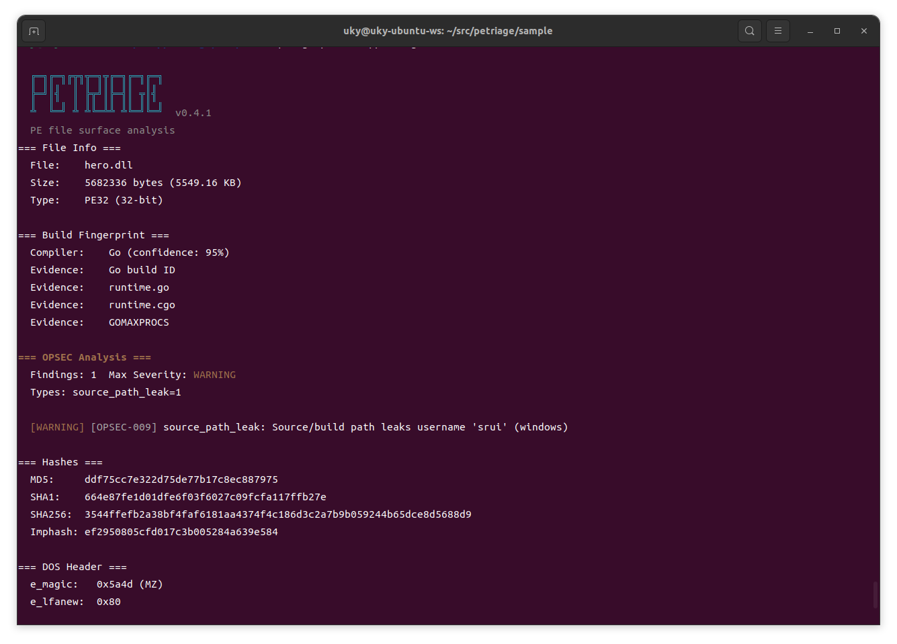
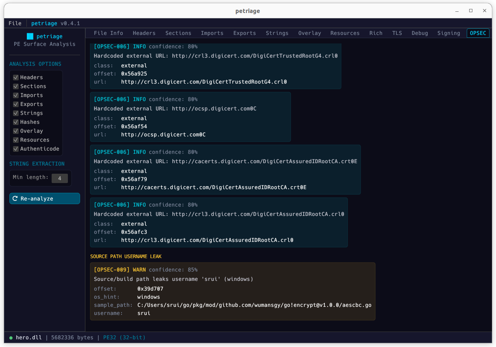

# Usage

## CLI

```
petriage <file.exe>              # Show all information (except strings)
petriage <file.exe> -a           # Show all information including strings
petriage <file.exe> -H           # Headers only
petriage <file.exe> -i           # Imports only
petriage <file.exe> -e           # Exports only
petriage <file.exe> -s           # Sections only
petriage <file.exe> -S           # Strings only
petriage <file.exe> --hashes     # File hashes only
petriage <file.exe> --overlay    # Overlay only
petriage <file.exe> -r           # Resources only
petriage <file.exe> -c           # Authenticode / code signing info
petriage <file.exe> --json       # JSON output
petriage <file.exe> --ndjson     # Compact one-line JSON output
petriage --batch <dir> --ndjson  # Batch-analyze all PEs in a directory (NDJSON output)
petriage --batch <dir> --json    # Batch-analyze all PEs (JSON array output)
petriage <file.exe> --fail-on warning  # Exit code 3 if any warning+ anomaly found
petriage <file.exe> --opsec-strict     # Enable credential/endpoint scanning via strings
petriage <file.exe> -o report.txt      # Write to file
```

### jq recipes

```
petriage <file.exe> --json | jq '.build_fingerprint'
petriage <file.exe> --json | jq '.suspicious_summary'
petriage <file.exe> --json | jq '.imports[].functions[] | select(.risk != null)'
petriage <file.exe> --json | jq '.anomalies'
petriage <file.exe> --json | jq '.anomalies[] | select(.severity == "critical")'
petriage <file.exe> --json | jq '.opsec'
petriage <file.exe> --json | jq '.dotnet'
petriage <file.exe> --json | jq '.go'
petriage <file.exe> --json | jq '.resources.version_info'
petriage <file.exe> --json | jq '.authenticode.signer'
petriage <file.exe> --json | jq '.rich_header.rich_hash'
```

## TUI Hex Viewer

Requires `--features tui` build.

```
petriage -x <file.exe>           # Interactive hex viewer (short form)
petriage --view <file.exe>       # Interactive hex viewer (long form)
```

The TUI provides:

- **Split-pane layout** -- Left pane lists PE regions (DOS Header, COFF, Optional Header, sections, overlay); right pane shows hex dump
- **Region navigation** -- Up/Down arrows to select regions; hex view updates instantly
- **Hex scrolling** -- j/k for line scroll, PgUp/PgDn for page scroll, Home/End for jump
- **Classic hex format** -- Offset | hex bytes | ASCII sidebar, 16 bytes per line
- **Alternate screen** -- Launches in alternate terminal screen; restores on exit (like `git log`)

## GUI

Requires `--features gui` build.

```
petriage-gui                     # Open with file dialog
petriage-gui <file.exe>          # Open file directly in GUI
```

The GUI provides:

- **Tabbed interface** -- File Info, Headers, Sections, Imports, Exports, Strings, Overlay, Resources, Rich, TLS, Debug, Signing, OPSEC, Build, Editor
- **Drag & drop** -- Drop PE files onto the window to analyze
- **Left sidebar** -- Toggle analysis options and re-analyze without restarting
- **Import filter** -- Search API names across DLLs, "Suspicious only" toggle to surface risky APIs
- **String filter** -- Filter by text and encoding (ASCII / UTF-16)
- **Entropy color-coding** -- Section entropy highlighted green (<6) / yellow (6--7) / red (7--8)
- **Suspicious API indicators** -- Color-coded severity badges (red/yellow/cyan) on File Info and Imports tabs
- **Embedded icon display** -- Extracts and renders PE embedded icons (RT_GROUP_ICON / RT_ICON); primary icon shown on File Info tab, all icon groups on Resources tab
- **OPSEC panel** -- Grouped findings by type (PDB path, version mismatch, credentials, endpoints, source path leaks, CI/CD traces, Rich Header integrity) with severity badges and evidence drill-down
- **Build panel** -- Compiler fingerprint (.NET / Go / Rust / MSVC / MinGW), .NET metadata, Go build ID
- **PE Header Editor** -- Edit COFF/Optional/Section headers with hex DragValue inputs and flag checkboxes. Save As writes patched PE to disk
- **Hash copy buttons** -- One-click copy of MD5/SHA1/SHA256
- **Virtual scroll** -- Handles tens of thousands of strings without lag

## Demo: Real-World Triage Examples

### Sample 1: Signed Benign PE (OneDrive.exe)

Demonstrates PETriage's handling of a legitimate signed binary: MSVC build fingerprint, Rich Header analysis, vendor metadata, icon and Authenticode certificate chain parsing.

**CLI:**



**GUI:**



---

### Sample 2: OPSEC Leak with C2 URLs (Uphero.exe)

Malware sample with a developer OPSEC mistake: the PDB path leaks the build environment (`D:\youqu_job\SuperBrowser\wirevpnLauncher\...`).

**CLI:**



**GUI:**



---

### Sample 3: Packed Backdoor with EP Spoofing (chrysalis_backdoor.exe)

A warning indicates that the entry point (0x2c5d0) exists in the `.rdata` section but not in the `.text` section (**CODE-002**). Based on this, it is expected that code execution will begin during CRT initialization or similar processes.

**CLI:**



---

### Sample 4: Go RunPE Loader

Go-compiled PE automatically identified with 95% confidence via multi-marker detection. The Go build ID is extracted for campaign pivoting. Characteristic Go binary traits are visible: 8MB static binary, single DLL import (kernel32.dll), no Rich Header.

**CLI:**



---

### Sample 5: Go DLL with Developer Username Leak (hero.dll)

Go-compiled DLL where PETriage's **OPSEC-009** warning rule detects the developer username `srui` leaked through Go module cache paths (`C:/Users/srui/go/pkg/mod/...`) embedded in the binary.

**CLI:**



**GUI:**


